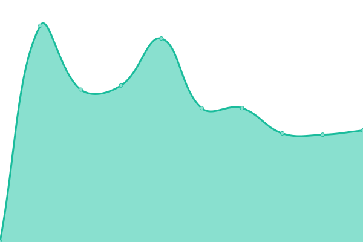
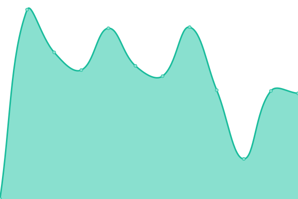

# [📈 Live Status](https://status.p2.csgroup.space): <!--live status--> **🟧 Partial outage**

This repository contains the open-source uptime monitor and status page for [CS-METIS](https://status.p2.csgroup.space), powered by [Upptime](https://github.com/upptime/upptime).

With [Upptime](https://upptime.js.org), you can get your own unlimited and free uptime monitor and status page, powered entirely by a GitHub repository. We use [Issues](https://github.com/CS-METIS/p2-status-page/issues) as incident reports, [Actions](https://github.com/CS-METIS/p2-status-page/actions) as uptime monitors, and [Pages](https://status.p2.csgroup.space) for the status page.

<!--start: status pages-->
<!-- This summary is generated by Upptime (https://github.com/upptime/upptime) -->
<!-- Do not edit this manually, your changes will be overwritten -->
<!-- prettier-ignore -->
| URL | Status | History | Response Time | Uptime |
| --- | ------ | ------- | ------------- | ------ |
|  [Landing page](https://p2.csgroup.space) | 🟩 Up | [landing-page.yml](https://github.com/CS-METIS/p2-status-page/commits/HEAD/history/landing-page.yml) | 

 611ms
     
 | 

<a href="https://status.p2.csgroup.space/history/landing-page">100.00%</a>
    

|  [SharingHub](https://sharinghub.p2.csgroup.space/openapi.json) | 🟩 Up | [sharing-hub.yml](https://github.com/CS-METIS/p2-status-page/commits/HEAD/history/sharing-hub.yml) | 

 764ms
     
 | 

<a href="https://status.p2.csgroup.space/history/sharing-hub">100.00%</a>
    

|  [Data analytics](https://superset.p2.csgroup.space) | 🟩 Up | [data-analytics.yml](https://github.com/CS-METIS/p2-status-page/commits/HEAD/history/data-analytics.yml) | 

 1602ms
     
 | 

<a href="https://status.p2.csgroup.space/history/data-analytics">100.00%</a>
    

|  [Lab](https://nb.p2.csgroup.space/hub/) | 🟩 Up | [lab.yml](https://github.com/CS-METIS/p2-status-page/commits/HEAD/history/lab.yml) | 

 1506ms
     
 | 

<a href="https://status.p2.csgroup.space/history/lab">100.00%</a>
    

|  [Auth server](https://auth.p2.csgroup.space/) | 🟩 Up | [auth-server.yml](https://github.com/CS-METIS/p2-status-page/commits/HEAD/history/auth-server.yml) | 

 126ms
     
 | 

<a href="https://status.p2.csgroup.space/history/auth-server">100.00%</a>
    

|  [Veille server](https://veille.p2.csgroup.space/) | 🟩 Up | [veille-server.yml](https://github.com/CS-METIS/p2-status-page/commits/HEAD/history/veille-server.yml) | 

 1105ms
     
 | 

<a href="https://status.p2.csgroup.space/history/veille-server">100.00%</a>
    

|  [HelpDesk](https://help.p2.csgroup.space/) | 🟥 Down | [help-desk.yml](https://github.com/CS-METIS/p2-status-page/commits/HEAD/history/help-desk.yml) | 

 0ms
     
 | 

<a href="https://status.p2.csgroup.space/history/help-desk">0.00%</a>
    

<!--end: status pages-->

[**Visit our status website →**](https://status.p2.csgroup.space)

## 📄 License

- Powered by: [Upptime](https://github.com/upptime/upptime)
- Code: [MIT](./LICENSE) © [CS-METIS](https://status.p2.csgroup.space)
- Data in the `./history` directory: [Open Database License](https://opendatacommons.org/licenses/odbl/1-0/)
